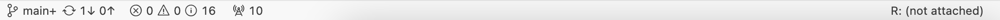

# Instructions for working with Lab assignments

HPM 881, Spring 2023

## Using STATA
StataCorp. Stata Statistical Software: Release 17.0. College Station, TX: Stata Corporation.  (www.stata.com) 

## Using R/RStudio

### Using R/RStudio locally

For local installation, you can follow one of numerous instructions online.   

You should first install [R](https://cran.r-project.org) and then [RStudio](http://www.rstudio.com).

### Using R/RStudio in GitHub

**1. Codepaces**

1) If you have access to GitHub CodeSpaces, click the green "<> Code" button at the top right on this repository page, and then select "Create codespace on main". (GitHub CodeSpaces is available with [GitHub Enterprise](https://github.com/enterprise) and [GitHub Education](https://education.github.com/).)

2) Click "R (not attached)"
   

**2. RStudio Cloud**
Click the Forwarded Ports "Radio (some times only shows 8787)" icon at the bottom of the VS Code Online window.

In the Ports tab, click the Open in Browser "World" icon that appears when you hover in the "Local Address" column for the Rstudio row.

This will launch RStudio Server in a new window. Log in with the username and password `rstudio/rstudio`. 

## Instructions for obtaining lab assignments

Each lab assignment will contain data, STATA material(log, do files), and R material (R scripts, Jupyter notebook)

You should start with the following steps.

1.  Read the instructions for each assignment
2.  Using STATA - work with do files and download the data
    Using R -  work with do files and the data

    1) Locally, create an RStudio project that clones this repo in your RStudio environment.  
    a) Click a project button (near the top-right corner of the screen)  
    b) Select "New Project" (this will open a popup window)  
    c) Select "Version Control"  
    d) Select "Git"  
    e) Enter this repository URL (https://github.com/unc-hpm-quant/Lab-assignment)  
    2) Code online, open the codespace/Colab/RStudio cloud.  
    a) Click the data folder, find the data files  
    b) Copy the data's path to the R script in Codespace/RStudio cloud/Colab  
    c) Work with the R script  
    d) Rename the R script files

    For each assignment, you will start with an R script file, which is in the RMarkdown format.  You should embed your answers, with code, into your R script file.

    To rename files, you can use Rstudio's rename capability: from the "Files" pane, tick the file to rename, then click "Rename".  (Or, if you prefer the command line, you can use R's `file.rename()` function.)

We will walk you through this process in the Day 1 lab, so don't worry if it seems complicated the first time.  This sort of careful workflow process and file management is part of learning practical data science too!

* NOTE: Sometimes, the RStudio window may fail to open with a timeout error. If this happens, try again, or restart the Codepace.
## Reference
1. ME314, LSE Methods Summer Programme 2021
2. revodavid/devcontainers-rstudio
